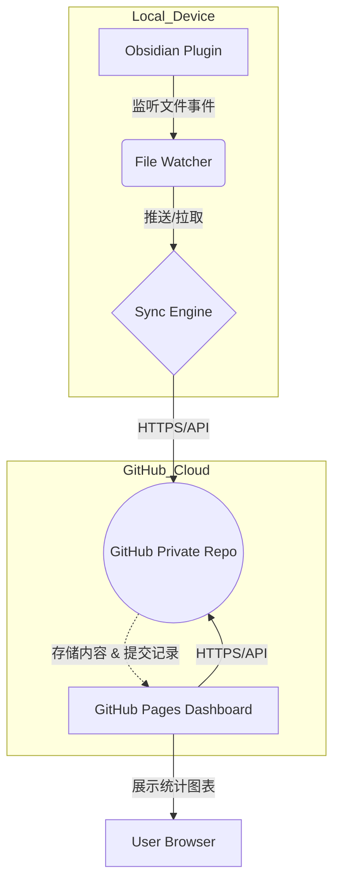

# 技术架构方案：GitHub API 驱动的 Obsidian 多端自动同步

## 1. 背景与目标
本项目旨在参考 `obsidian-github-sync-multi-platform` 的实时监听逻辑，将其后端由私有服务替换为 **GitHub API**，实现零成本、高可靠、全平台（Windows, Mac, iOS, Android）的 Obsidian 笔记自动同步。

### 核心特征
- **后端即仓库**：直接利用 GitHub 仓库存储数据，无需部署额外服务器。
- **全平台支持**：通过 HTTPS 协议调用 GitHub API，绕过移动端对 Git 命令行的限制。
- **实时同步**：继承原项目的 `TAbstractFile` 监听机制，实现“保存即推送”。
- **Antigravity 友好**：采用模块化设计，结构清晰，便于 AI IDE (如 Antigravity) 进行代码生成、优化及维护。

## 2. 技术栈
- **核心框架**：Obsidian Plugin API (TypeScript)
- **通信层**：[Octokit](https://github.com/octokit/rest.js) (GitHub 官方 SDK) 或 轻量级 Fetch API
- **状态管理**：本地 JSON 存储文件 SHA 值与同步时间戳
- **冲突处理**：基于三方合并（3-way merge）逻辑或简单的“最后修改者胜”策略

## 3. 系统架构图

## 4. 核心同步策略 (Sync Engine)
... (保持原有内容) ...

## 5. Dashboard 统计逻辑 (Statistics)
- **数据源**：利用 GitHub API 遍历指定分支下的所有 `.md` 文件。
- **字数计算**：在浏览器端对下载的文本内容进行正则过滤（去除 Markdown 语法标签），计算纯中文字符和英文单词数。
- **时间维度**：通过文件的 `Commit History` 获取每个月的变更状态，生成月度字数趋势图。
- **性能优化**：由于频繁遍历 API 较慢，插件端在同步时可选推送一个隐藏的 `stats.json` 索引文件，Dashboard 直接读取该索引实现秒开。

## 6. 安全性设计 (Security)
- **无后台认证**：Dashboard 不存储任何密码。
- **Token 鉴权**：访问 Dashboard 时，用户需输入 GitHub PAT（存入 LocalStorage）。
- **私有隔离**：建议将 Dashboard 代码仓库设为 Public（启用 Pages），但笔记内容仓库保持 Private，通过 PAT 跨库访问。

